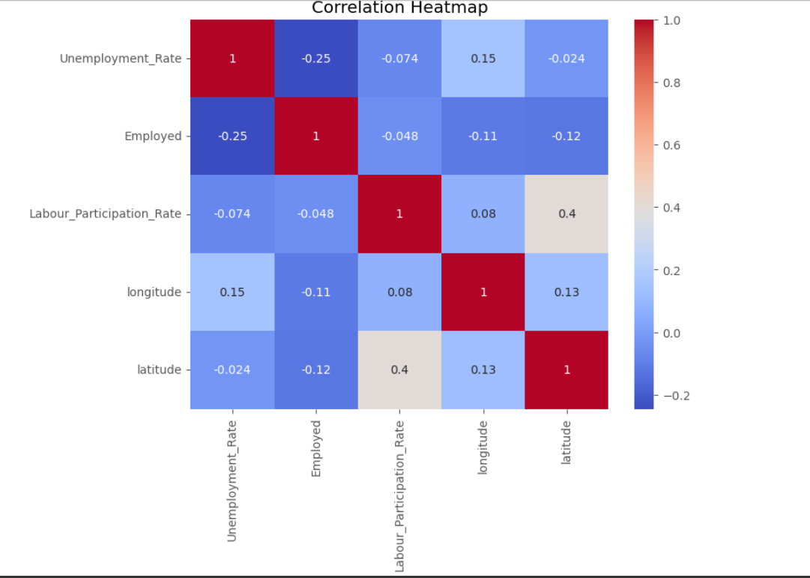
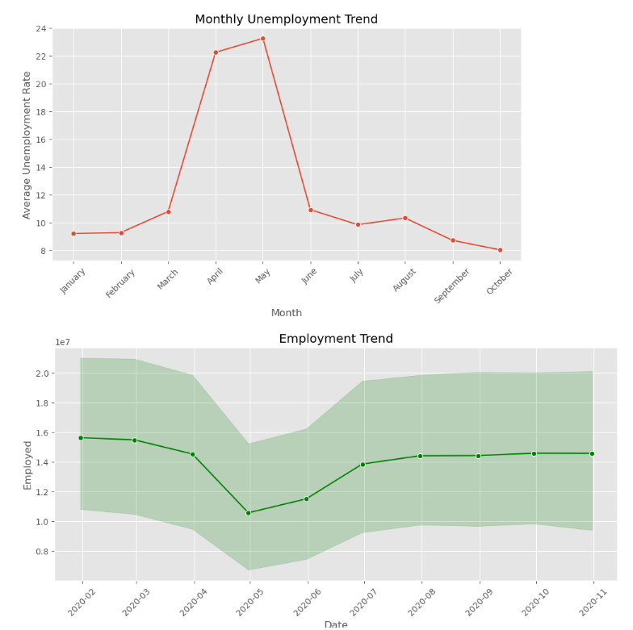
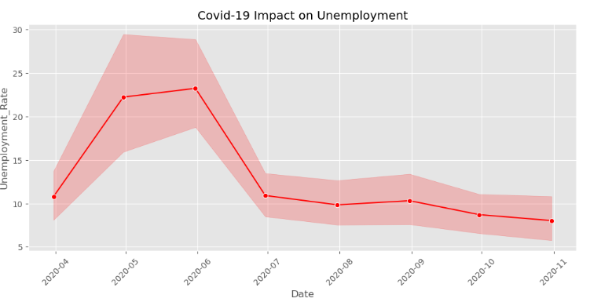
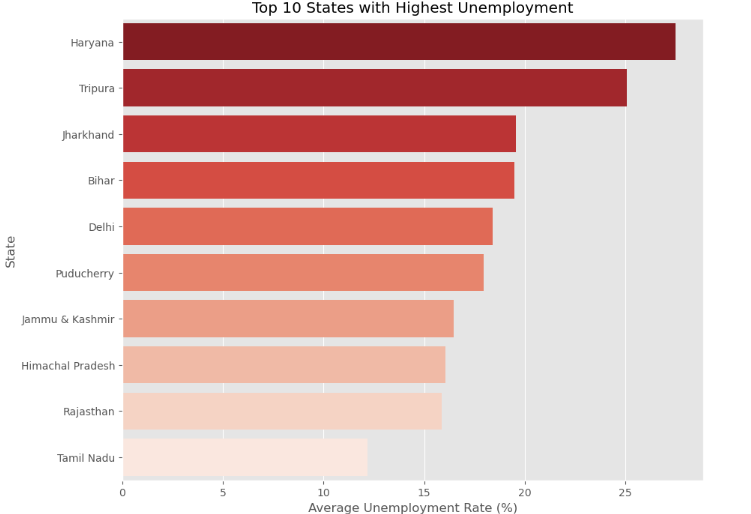

# 📊 Unemployment Analysis with Python

## 📌 Project Overview

This project analyzes unemployment trends in India using Python and data visualization techniques. The analysis focuses on understanding unemployment patterns, investigating the impact of the Covid-19 pandemic, identifying seasonal trends, and extracting meaningful insights that can support economic and employment-related decision-making.

---

## 🎯 Objective

- Analyze unemployment rate data across different states in India.
- Perform data cleaning and preprocessing.
- Explore unemployment trends using data visualization.
- Investigate the impact of Covid-19 on unemployment rates.
- Identify monthly and seasonal unemployment patterns.
- Generate insights to support employment and economic policies.

---

## 📂 Dataset Used

**Dataset:** Unemployment Rate in India

**Source:** Kaggle

https://www.kaggle.com/datasets/gokulrajkmv/unemployment-in-india

---

## 🛠️ Technologies Used

- Python
- Pandas
- NumPy
- Matplotlib
- Seaborn
- Jupyter Notebook

---

## ✨ Key Features

- Data Cleaning
- Missing Value Handling
- Data Exploration (EDA)
- Correlation Analysis
- Monthly Trend Analysis
- State-wise Unemployment Analysis
- Covid-19 Impact Analysis
- Data Visualization
- Policy Insights

---

## 📊 Data Visualizations

- Correlation Heatmap
- Distribution of Unemployment Rate
- Box Plot
- Top 10 States with Highest Unemployment
- Monthly Unemployment Trend
- Employment Trend Over Time
- Covid-19 Impact Analysis
- Labour Participation vs Unemployment (Scatter Plot)
- Pair Plot

---

## 📈 Key Findings

- Unemployment rates increased significantly during the Covid-19 pandemic.
- Certain states consistently experienced higher unemployment than others.
- Monthly analysis revealed noticeable seasonal fluctuations in unemployment.
- Labour Participation Rate showed a moderate relationship with unemployment.
- Data-driven insights can help policymakers design effective employment generation programs.

---

## 📷 Project Screenshots

### Correlation Heatmap

### Monthly Unemployment Trend

### Covid-19 Impact Analysis

### Top 10 States with Highest Unemployment

## 📓 Notebook
https://github.com/priya666rout-lab/codeAlpha_Unemployment-Analysis-with-Python/blob/main/unemployment.ipynb

## 🚀 Repository

https://github.com/priya666rout-lab/Unemployment-Analysis-with-Python

---

## 👩‍💻 Author

**Priya Rout**

B.Tech Computer Science & Engineering (Data Science)
Passionate about Data Science, Machine Learning, Data Analytics, and Data Visualization.
